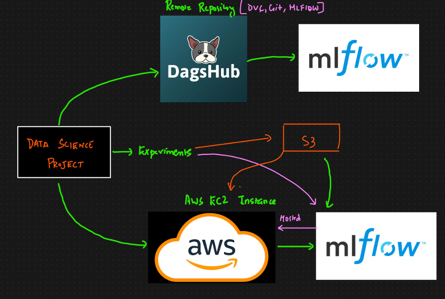

# Introduction To MLflow In AWS

## What We Are Learning In This Part

Here we are trying to understand how to track machine learning experiments using `MLflow` on `AWS`.

The overall idea is:

- build a simple data science project locally
- run experiments from that project
- host the `MLflow` tracking server on an `AWS EC2` instance
- access the tracking UI using a remote URL

So the main focus is **remote MLflow tracking on AWS**.

## Connection With What We Learned Earlier

Earlier, we had already seen experiment tracking with `MLflow` on `DagsHub`.

That helped us understand how:

- `Git` can manage code
- `DVC` can manage data and versioning
- `MLflow` can track experiments
- `DagsHub` can act as a remote platform

Now we are extending the same idea and shifting the MLflow tracking part to `AWS`.

## Why We Need MLflow On AWS

In real projects, teams often do not keep everything in a platform like `DagsHub`.

Many teams work with:

- `GitHub`
- `GitLab`
- internal Git repositories

At the same time, their applications and infrastructure are often hosted on `AWS`.

Because of that, it makes sense for us to learn how to:

- host the MLflow server in the cloud
- let multiple team members use the same tracking setup
- keep experiment tracking closer to the production environment

## Main Goal

Our immediate goal here is not to deploy the full application.

The goal is:

- create a simple ML project
- run experiments from it
- track those experiments using `MLflow`
- host the tracking server on `AWS EC2`

So the full picture is:

`local ML project -> MLflow tracking server on AWS -> remote experiment tracking`

## What Will Actually Run On AWS

The main component hosted on AWS in this setup is:

- the `MLflow` tracking server

That means:

- the project code can run locally
- experiment details can be sent to the remote MLflow server
- the tracking UI can be opened through an AWS-hosted URL

For now, the focus is on experiment tracking only, not full application deployment.

## AWS Service We Need To Remember

The key AWS service here is:

- `EC2`

`EC2` is used to host the MLflow server.

This is important because the MLflow UI and tracking backend need a machine where the server can actually run.

## Our Learning Flow For This Module

The sequence we need to remember is:

1. create a simple data science project
2. run experiments from that project
3. create an AWS EC2 instance
4. install `MLflow` on that instance
5. connect the local project to the remote MLflow server
6. track experiments in the AWS-hosted MLflow UI

## Why This Setup Is Useful In Team Work

This setup is useful in collaborative environments because:

- the team can use one shared tracking platform
- experiments are easier to compare
- tracking is no longer tied to one local machine
- cloud-based tracking is closer to real production systems

## Key Takeaway

The most important thing we want to remember is:

- we already know MLflow tracking with `DagsHub`
- now we are learning MLflow tracking with `AWS`
- the project itself stays simple
- the main learning focus is remote experiment tracking through `EC2`

## One-Line Summary

We are learning how to run a simple machine learning project locally while tracking all experiments through an `MLflow` server hosted on `AWS EC2`.
